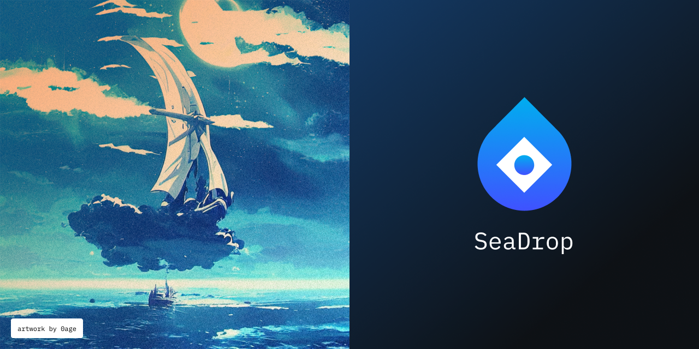
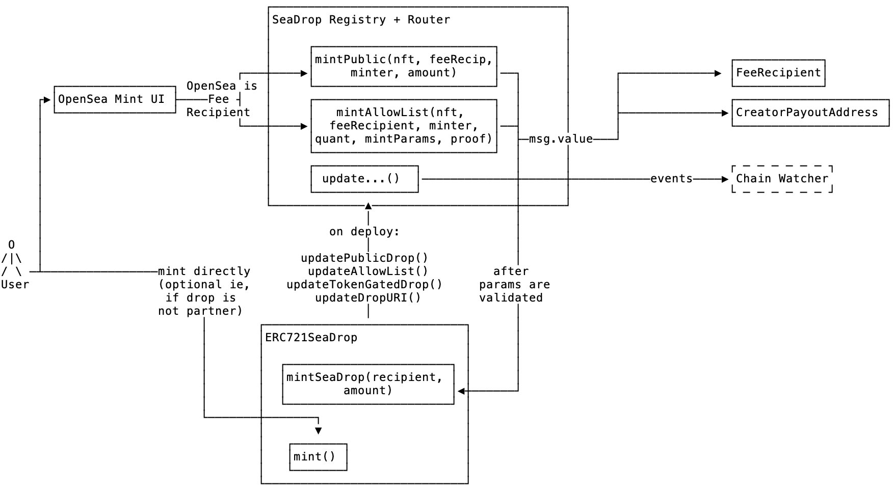

# SeaDrop

SeaDrop is a contract for conducting primary NFT drops on evm-compatible blockchains.

## Table of Contents

- [SeaDrop](#seadrop)
  - [Table of Contents](#table-of-contents)
  - [Background](#background)
  - [Deployments](#deployments)
  - [Diagram](#diagram)
  - [Install](#install)
  - [Usage](#usage)
    - [Foundry Tests](#foundry-tests)
  - [Audits](#audits)
  - [Contributing](#contributing)
  - [License](#license)

## Background

SeaDrop is a contract to perform primary drops on evm-compatible blockchains. The types of drops supported are public drops, allow list stages, token gated drops, and server-side signed mints. An implementing token contract should contain the methods to interface with `SeaDrop` through an authorized user such as an Owner or Administrator.

Future SeaDrop contracts are envisioned to contain additional functionality like descending dutch auction mechanisms and payment in ERC20 tokens.

## Deployments

<table>
<tr>
<th>Network</th>
<th>SeaDrop 1.0</th>
</tr>

<tr><td>Ethereum</td><td rowspan="14">

[0x00005EA00Ac477B1030CE78506496e8C2dE24bf5](https://etherscan.io/address/0x00005EA00Ac477B1030CE78506496e8C2dE24bf5#code)

</td></tr>
<tr><td>Goerli</td></tr>
</table>

To be deployed on other EVM chains, such as:

Short-term:

- Polygon
- Mumbai
- Optimism
- Optimistic Kovan
- Arbitrum
- Arbitrum Rinkeby
- Avalanche Fuji
- Avalanche C-Chain
- Gnosis Chain
- BSC

Long-term:

- Klaytn
- Baobab
- Skale
- Celo
- Fantom
- RSK

To deploy to a new EVM chain, follow the [steps outlined here](docs/SeaDropDeployment.md).

Docs:

- [SeaDrop Deployment](docs/SeaDropDeployment.md)
- [SeaDrop Token Deployment](docs/SeaDropTokenDeployment.md)
- [Bring Your Own Token Contract](docs/BringYourOwnTokenContract.md)
- [Provenance Hash](docs/ProvenanceHash.md)

## Diagram



## Install

To install dependencies and compile contracts:

```bash
git clone https://github.com/ProjectOpenSea/primary-drops-evm && cd primary-drops-evm
yarn install
yarn build
```

## Usage

To run hardhat tests written in javascript:

```bash
yarn test
yarn coverage
```

To profile gas usage:

```bash
yarn profile
```

### Foundry Tests

SeaDrop also includes a suite of fuzzing tests written in solidity with Foundry.

To install Foundry (assuming a Linux or macOS system):

```bash
curl -L https://foundry.paradigm.xyz | bash
```

This will download foundryup. To start Foundry, run:

```bash
foundryup
```

To install dependencies:

```
forge install
```

To run tests:

```
forge test
```

To run gas snapshot:

```
forge snapshot
```

The following modifiers are also available:

- Level 2 (-vv): Logs emitted during tests are also displayed.
- Level 3 (-vvv): Stack traces for failing tests are also displayed.
- Level 4 (-vvvv): Stack traces for all tests are displayed, and setup traces for failing tests are displayed.
- Level 5 (-vvvvv): Stack traces and setup traces are always displayed.

```bash
forge test  -vv
```

For more information on foundry testing and use, see [Foundry Book installation instructions](https://book.getfoundry.sh/getting-started/installation).

To run lint checks:

```bash
yarn lint:check
```

Lint checks utilize prettier, prettier-plugin-solidity, and solhint.

```javascript
"prettier": "^2.5.1",
"prettier-plugin-solidity": "^1.0.0-beta.24",
```

## Contributing

Contributions to SeaDrop are welcome by anyone interested in writing more tests, improving readability, optimizing for gas efficiency, or extending the protocol with new features.

When making a pull request, ensure that:

- All tests pass.
- Code coverage remains at 100% (coverage tests must currently be written in hardhat).
- All new code adheres to the style guide:
  - All lint checks pass.
  - Code is thoroughly commented with natspec where relevant.
- If making a change to the contracts:
  - Gas snapshots are provided and demonstrate an improvement (or an acceptable deficit given other improvements).
  - Reference contracts are modified correspondingly if relevant.
  - New tests (ideally via foundry) are included for all new features or code paths.
- If making a modification to third-party dependencies, `yarn audit` passes.
- A descriptive summary of the PR has been provided.

## License

[MIT](LICENSE) Copyright 2022 Ozone Networks, Inc.
